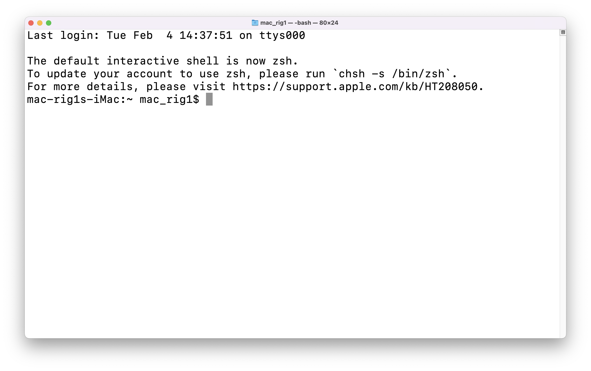
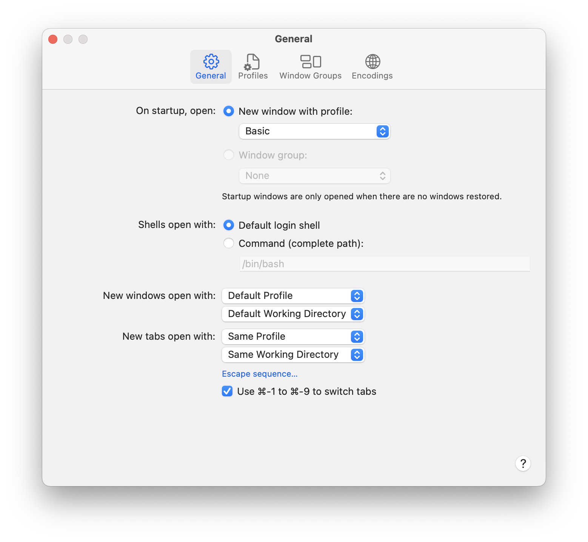
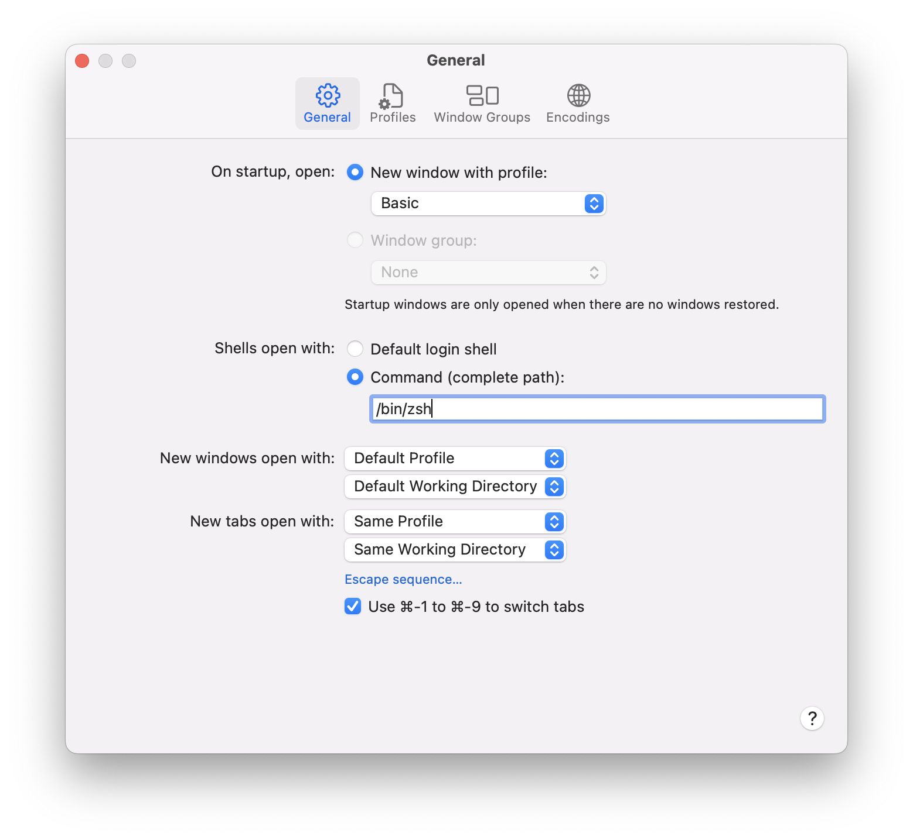

# Change the default shell to ZSH

1. In the Terminal app on your Mac, choose Terminal > Preferences, then click General.

2. Under “Shells open with,” select “Command (complete path),” then enter the path to the shell you want to use.

3. For zsh enter `bin/zsh`

4. Then open your terminal in MacOS you will see zsh as your default shell enjoy!

